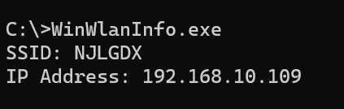
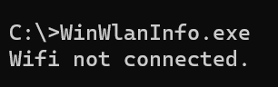

# WinWlanInfo

> Small tool to get currently connected Wifi's SSID & IP Address

## Usage

- Execute `WinWlanInfo.exe` directly in cmd / powershell.

- If any wifi connected:

  

- If no wifi connected:

  

- No administrator permission needed.

## Compile

- Visual Studio 2022 or higher
- Windows SDK installed